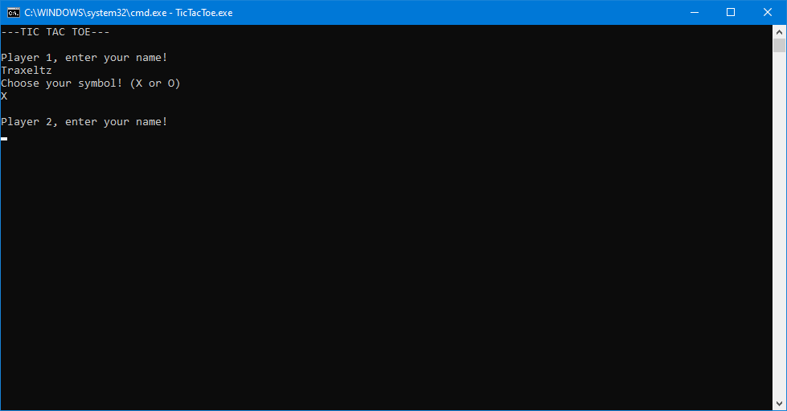
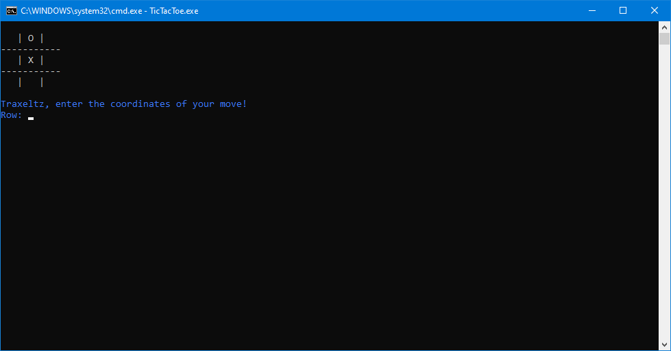
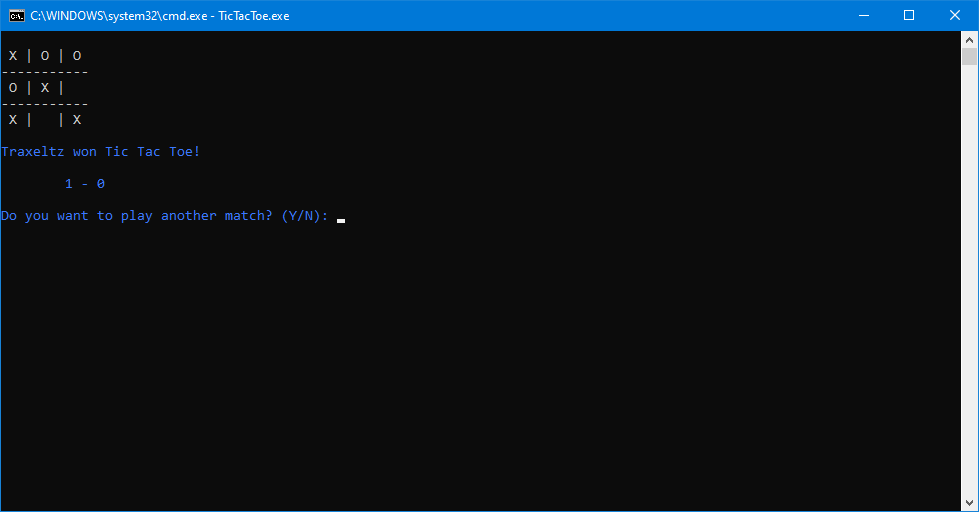

# Tic Tac Toe
This is a Tic Tac Toe game for 2 players, developed in C# using Visual Studio IDE. It can be played in the console. The game can be played for how many rounds as the players want, and it keeps track of the score.

## How to Play
- The game is played **on a 3x3 grid**.
- Players **take turns** placing their marks (X or O) in empty cells. The first player **uses X**, and the second player **uses O**.
- The first player to get **3 of their marks in a row** (horizontally, vertically, or diagonally) wins the round.
- If all 9 cells are **filled and no player has 3 in a row**, the round ends in a draw.
- After each round, players can **choose** to play again or exit the game.

### How to Make a Move
- Players are prompted to **enter their move** by specifying the **row and column numbers** (1, 2, or 3).
- For example, entering `1 3` places the player's mark in the **first row and third column**.
- If a player tries to place their mark in an **already occupied cell** or enters **invalid coordinates**, they will be prompted to **enter a valid move**.
- The game continues until a **player wins** or the round **ends in a draw**.

## Prerequisites
To compile and run this project, you need to have the **Roslyn compiler (`csc.exe`)** installed on your machine. The compiler is included with the **.NET SDK (Software Development Kit)**.

### How to install the .NET SDK
1. Go to the **official .NET [download page](https://dotnet.microsoft.com/download)**:
2. **Download and install the recommended SDK version** for your operating system.
3. After installation, **verify that the compiler is available by running the following command** in your terminal or command prompt:  
   `csc -help`  
   If the compiler help **is displayed**, the installation was successful.

## Configuration
1. Initially, **download repository files** to your local machine.  
You can do it using **one of three manners**:
    - **Download ZIP**
      - Access [repository page](https://github.com/Traxeltz/Tic-Tac-Toe/tree/master).
      - Click on **"Code"** green button and then **"Download ZIP"**.
      - Finally, **extract the ZIP file** to your desired location.
    - **Clone with HTTPS** (Git must be installed)
      - Open your terminal.
      - Run the command:  
        `git clone https://github.com/Traxeltz/Tic-Tac-Toe.git <custom-folder-name>`.
    - **Clone with GitHub Desktop** (GitHub Desktop must be installed)
      - Access [repository page](https://github.com/Traxeltz/Tic-Tac-Toe/tree/master).
      - Click on **"Code"** green button and then **"Open with GitHub Desktop"**.
      - Click on **"Choose..."** to select the local path where you want to clone the repository.
      - Confirm by clicking on **"Clone"**.
2. **Compile source files** using Roslyn compiler (`csc.exe`).  
You need to have **.NET Framework SDK** installed to have access to the compiler.  
Check the [Prerequisites](#prerequisites) section to see how to install it if you don't install yet.
   - To compile the source files, **open your terminal** and **navigate to the folder** where you downloaded/cloned the repository.
   - **Open the Tic Tac Toe folder**.
   - Then, run the following command:  
   `csc TicTacToe.cs Player.cs Player1.cs Player2.cs -out:TicTacToe.exe`.
   - Finally, if the compilation is successful, you will find the `TicTacToe.exe` file in the same folder. **Execute it** to start the game.

## Used Technologies
- C# programming language
- Visual Studio IDE
- .NET Framework
- Roslyn compiler (`csc.exe`)
- Git (for cloning the repository)
- GitHub (for hosting the repository)
- Markdown (for documentation)

## Game Preview
  
  

---

#### Final Notes
- Initial commits were made for a college activity, in 2024. A year later, I decided to improve the code and add more features.
- Because the project was initially made for a college activity, the code may not follow best practices or be fully optimized for performance.
- Besides that, the code was written initially in Portuguese, as it was originally written for an Portuguese-speaking audience. I translated all the comments and messages to English to make it more accessible to a wider audience.
- The initial commits didn't follow best commit practices, once I was learning Git and GitHub in 2024, but I improved it in the last commits.
- The repository was initially private, because I wanted to keep it private until I improved the code and added more features. The repository was made public in September 2025.
- Besides that, I added a detailed README file to explain how to use the project and its features.

---

**Feel free to fork the repository, make improvements, and contribute to the project!**